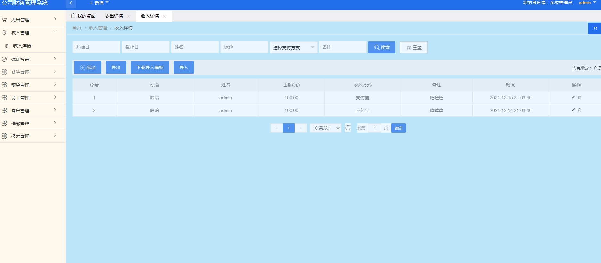

# 1.项目介绍
- 系统角色：管理员、员工、可以通过角色管理自行创建角色
- 功能模块：支出管理、收入管理、统计报表、系统管理、预算管理、员工管理、客户管理、催缴管理、报表管理等
- 技术选型：SpringBoot，themeleaf，LayUI等
- 测试环境：idea2024，jdk1.8，mysql5.7，maven3
# 2.项目部署
- 创建数据库，导入sql文件
- idea打开目录financial，根据本地数据库环境修改src/main/resources/application.yml 11-14行
- 启动项目src/main/java/com/example/cwgl/CwglApplication.java
- http://localhost:8080  管理员账号密码：admin/123456
# 3.项目部分截图

# 4.获取方式
[戳我查看](https://gitee.com/aven999/mall)
